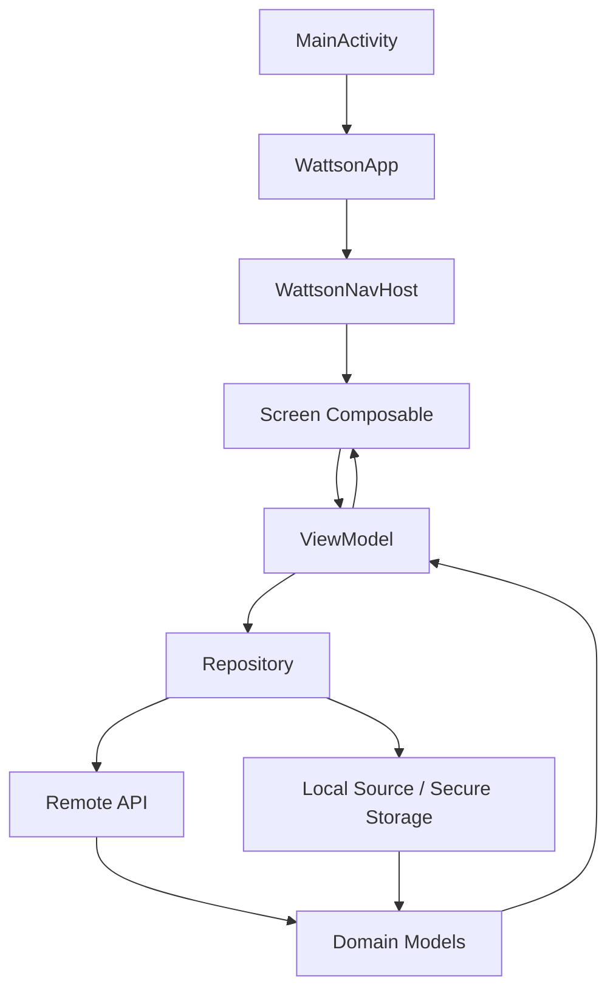
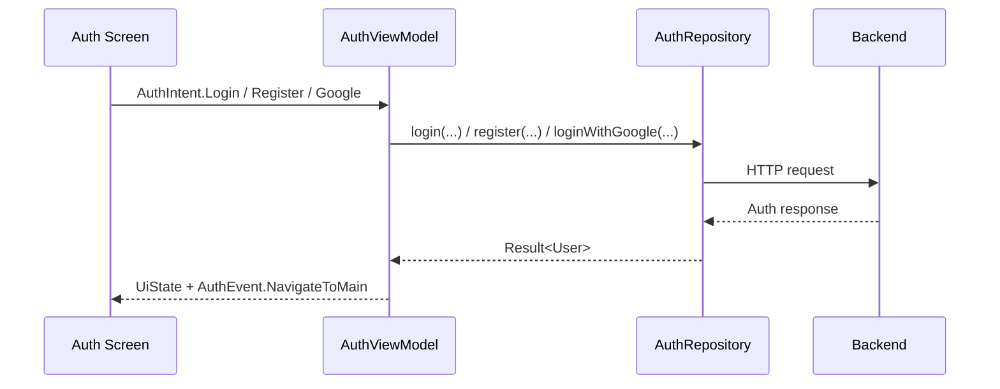

# Wattson · Guide d’architecture

> **Document de référence** pour comprendre la structure technique du projet, les choix d’architecture retenus, leurs avantages, leurs limites, et les principes qui doivent guider les prochains refactors.

---

## Introduction exécutive

Wattson est aujourd’hui une application Android **single-module** construite avec **Kotlin**, **Jetpack Compose**, **Hilt**, **Retrofit/OkHttp**, **Coroutines/Flow** et une infrastructure **Room** déjà en place.  
L’architecture actuelle n’essaie pas d’être “pure” au sens académique du terme. Elle vise un équilibre explicite entre :

- **lisibilité**
- **séparation des responsabilités**
- **coût de maintenance raisonnable**
- **capacité d’évolution**

La structure générale suit une logique simple :

1. la **UI** rend un état ;
2. les **ViewModels** orchestrent l’état écran ;
3. les **repositories** coordonnent les accès aux données ;
4. les **modèles de domaine** servent de vocabulaire métier commun ;
5. la **DI** encapsule la construction des dépendances techniques.

Cette approche est cohérente avec :

- les recommandations **Android Developers** sur l’architecture d’application et la **UI layer** ;
- les recommandations **Kotlin / JetBrains** sur les conventions de code, les coroutines et la documentation ;
- les recommandations **Gradle** sur la centralisation des dépendances et des repositories[^gradle].

> [!IMPORTANT]
> Ce document distingue volontairement :
> - ce qui relève d’une **recommandation officielle** ;
> - ce qui relève d’une **décision projet** adaptée à la taille actuelle du dépôt.

---

## Sommaire

- [1. Périmètre et contexte](#1-périmètre-et-contexte)
- [2. Vue d’ensemble de l’architecture](#2-vue-densemble-de-larchitecture)
- [3. Cartographie du code](#3-cartographie-du-code)
- [4. Couches et responsabilités](#4-couches-et-responsabilités)
- [5. Flux applicatifs structurants](#5-flux-applicatifs-structurants)
- [6. Pourquoi ces choix](#6-pourquoi-ces-choix)
- [7. Décisions techniques majeures](#7-décisions-techniques-majeures)
- [8. Exemples d’implémentation](#8-exemples-dimplémentation)
- [9. Bonnes pratiques de contribution](#9-bonnes-pratiques-de-contribution)
- [10. Erreurs fréquentes à éviter](#10-erreurs-fréquentes-à-éviter)
- [11. Compromis actuels et dette technique](#11-compromis-actuels-et-dette-technique)
- [12. Checklist d’évaluation avant refactor](#12-checklist-dévaluation-avant-refactor)
- [13. FAQ technique](#13-faq-technique)
- [14. Références officielles](#14-références-officielles)
- [15. À retenir](#15-à-retenir)
- [16. Conclusion](#16-conclusion)

---

## 1. Périmètre et contexte

### 1.1 Ce que ce README documente

Ce document couvre :

- l’architecture **réelle** du dépôt ;
- les **responsabilités** de chaque couche ;
- les **raisons** derrière les choix techniques ;
- les **conventions** à préserver dans les prochains développements.

### 1.2 Ce que ce README ne prétend pas faire

Ce document n’est **ni** :

- une spécification produit complète ;
- une documentation API backend ;
- une promesse d’architecture “définitive” ;
- un manifeste dogmatique autour d’un pattern particulier.

### 1.3 Positionnement architectural

Le projet se situe aujourd’hui dans une zone intermédiaire :

| Sujet | État actuel | Intention |
|:--|:--|:--|
| Modularity | Mono-module `:app` | Garder la livraison simple tant que les frontières restent lisibles |
| UI | Compose + écrans orientés état | Rendre la data flow visible |
| Orchestration | `ViewModel` par feature | Conserver un état écran stable et testable |
| Data access | Repositories | Isoler réseau, stockage, parsing et règles IO |
| Domain layer | Modèles métier communs | Éviter les DTO dans la UI |
| Use cases | Non généralisés | Les introduire seulement si la complexité le justifie[^domain] |

---

## 2. Vue d’ensemble de l’architecture

### 2.1 Schéma global



### 2.2 Lecture rapide

Le flux dominant est volontairement **descendant pour l’état** et **ascendant pour les actions** :

- les **données** descendent vers les composables ;
- les **intentions utilisateur** remontent vers les ViewModels ;
- les **effets ponctuels** passent par des `SharedFlow<Event>` ;
- les **accès techniques** restent dans les repositories.

### 2.3 Résumé en une phrase

<ins>Wattson est une application Compose à couches explicites, organisée par features côté UI et par responsabilités côté data.</ins>

> [!NOTE]
> Le packaging “feature-first” de la UI est une **interprétation projet** des recommandations officielles, pas une obligation Android stricte. L’objectif est d’améliorer l’appropriation du code par feature.

---

## 3. Cartographie du code

### 3.1 Arborescence principale

```text
app/src/main/java/com/wattson
|-- MainActivity.kt
|-- WattsonApplication.kt
|-- data
|   |-- auth
|   |-- local
|   |-- ocr
|   |-- remote
|   `-- repository
|-- di
|-- domain
|   `-- model
`-- ui
    |-- components
    |-- navigation
    |-- screens
    `-- theme
```

### 3.2 Vue fonctionnelle par zone

| Dossier | Rôle | Exemples |
|:--|:--|:--|
| `ui/navigation` | Entrée Compose, routes, guards de navigation | `WattsonNavGraph.kt`, `NavigationRoutes.kt` |
| `ui/screens/*` | Features écran par écran | `auth`, `scan`, `documents`, `repair` |
| `ui/components` | Composants réutilisables | boutons, cartes, bottom bar |
| `data/repository` | Coordination des accès aux données | auth, produits, documents, repair chat |
| `data/remote` | Stack HTTP, auth transport, DTO | `WattsonApi`, `AuthInterceptor`, `TokenAuthenticator` |
| `data/local` | Infrastructure Room | `AppDatabase`, DAOs |
| `data/ocr` | Lecture EPREL / OCR | parsing, services OCR |
| `domain/model` | Types métier partagés | `Product`, `Document`, `Scan`, `User` |
| `di` | Construction explicite des dépendances | `NetworkModule`, `DatabaseModule` |

### 3.3 Fichiers structurants à connaître en priorité

| Priorité | Fichier | Pourquoi il compte |
|:--:|:--|:--|
| 1 | [`app/src/main/java/com/wattson/MainActivity.kt`](app/src/main/java/com/wattson/MainActivity.kt) | Racine de la composition et auth guard globale |
| 2 | [`app/src/main/java/com/wattson/ui/navigation/WattsonNavGraph.kt`](app/src/main/java/com/wattson/ui/navigation/WattsonNavGraph.kt) | Centre de la navigation et des destinations protégées |
| 3 | [`app/src/main/java/com/wattson/data/repository/AuthRepository.kt`](app/src/main/java/com/wattson/data/repository/AuthRepository.kt) | Source de vérité du statut de session |
| 4 | [`app/src/main/java/com/wattson/data/repository/ProductRepository.kt`](app/src/main/java/com/wattson/data/repository/ProductRepository.kt) | Orchestration des scans et lookup produit |
| 5 | [`app/src/main/java/com/wattson/ui/screens/documents/DocumentsViewModel.kt`](app/src/main/java/com/wattson/ui/screens/documents/DocumentsViewModel.kt) | Exemple représentatif de state holder riche |

---

## 4. Couches et responsabilités

### 4.1 Vue synthétique

| Couche | Mission | Dépend de | Ne doit pas faire |
|:--|:--|:--|:--|
| UI | Afficher l’état et propager les actions | ViewModels, composants UI | Faire du réseau, parser des DTO, construire des headers |
| ViewModel | Gérer l’état écran et l’orchestration | Repositories, modèles de domaine | Définir la navigation globale, accéder directement à Android framework lourdement |
| Data | Parler au backend, au stockage, au transport | API, stockage local, sécurité | Rendre des DTO directement à la UI |
| Domain model | Exprimer le métier | Rien d’infra lourd | Connaître Retrofit, Room, Hilt |
| DI | Construire les objets techniques | Framework + constructeurs | Contenir de la logique métier |

### 4.2 Couche UI

La couche UI est composée de :

- composables écran ;
- composables réutilisables ;
- navigation ;
- thème.

Elle est conçue pour rester **déclarative** :

```text
UI = f(state)
```

En pratique, cela signifie :

- une UI qui **rend** ;
- un `ViewModel` qui **décide** ;
- un repository qui **accède** aux données.

### 4.3 ViewModels comme state holders

Chaque feature importante expose généralement :

- un `UiState`
- un `Intent`
- un `Event`
- un `ViewModel`

Cette structure s’aligne bien avec Compose car elle sépare :

- l’**état durable**
- les **actions utilisateur**
- les **effets ponctuels**

<details>
<summary><strong>Détail : pourquoi séparer <code>UiState</code> et <code>Event</code> ?</strong></summary>

Un message de snackbar, une navigation ou une ouverture de sélecteur de fichier n’ont pas vocation à rester dans l’état persistant de l’écran.  
Les représenter via un `SharedFlow<Event>` évite :

- les re-triggers à la recomposition ;
- les hacks du type “flag booléen à remettre à false” ;
- le mélange entre données d’affichage et effets.

</details>

### 4.4 Couche data

La couche data concentre les détails techniques qui ne doivent pas remonter plus haut :

- appels réseau ;
- authentification de transport ;
- refresh token ;
- parsing ;
- upload multipart ;
- stockage sécurisé ;
- mapping DTO → domaine.

Elle constitue la frontière naturelle entre le monde applicatif et le monde technique.

### 4.5 Modèles de domaine

Le package `domain/model` ne contient pas une “domain layer” complète au sens DDD strict.  
Il joue aujourd’hui un rôle plus pragmatique :

- fournir un **vocabulaire métier stable** ;
- éviter que la UI manipule des DTO backend ;
- réduire le couplage aux contrats réseau.

### 4.6 Injection de dépendances

Hilt est utilisé pour :

- injecter les repositories ;
- fournir `Retrofit`, `OkHttpClient`, `WattsonApi` ;
- fournir la base Room ;
- injecter les ViewModels de manière cohérente avec Android.

> [!TIP]
> Hilt n’est pas utilisé ici comme un “gadget de framework”, mais comme un moyen de **rendre explicite** la composition des dépendances tout en évitant le bootstrap manuel répétitif.

---

## 5. Flux applicatifs structurants

### 5.1 Authentification



#### Ce qu’il faut retenir

- `AuthRepository` est la **source de vérité applicative** pour l’état de session.
- La navigation ne dépend pas d’un “flag local” d’écran, mais d’un état observé au niveau racine.
- Le flux Google Sign-In est isolé via `GoogleAuthManager` car il dépend d’API Android spécifiques.

### 5.2 Scan produit

Le scan combine trois natures de responsabilités :

| Nature | Portée | Exemple |
|:--|:--|:--|
| UI temps réel | écran | aperçu caméra, overlay, torch |
| Orchestration d’état | ViewModel | mode scan, erreur, retry, navigation |
| Résolution métier / transport | repository | lookup EAN, lookup EPREL, enregistrement du scan |

#### Séquence simplifiée

```text
Camera / barcode
  -> ScanFrameAnalyzer
    -> ScanViewModel
      -> ProductRepository
        -> scan API / product API / EPREL API
      -> navigation vers ProductDetail
```

### 5.3 Documents

Le flux documents est intéressant car il combine :

- listing ;
- filtrage ;
- upload ;
- delete ;
- polling post-upload ;
- téléchargement.

Le choix retenu est de garder :

- la **présentation écran** dans le `DocumentsViewModel` ;
- les **règles de transformation UI** dans des helpers dédiés ;
- les **détails HTTP / multipart** dans `DocumentRepository`.

### 5.4 Repair chat

Le repair chat est actuellement **backend-driven** :

- conversations et messages côté serveur ;
- UI optimiste côté écran ;
- Room présent mais non central dans le flux courant.

Cette architecture permet de préserver une future voie **offline/cache** sans imposer aujourd’hui un local-first plus coûteux que nécessaire.

---

## 6. Pourquoi ces choix

### 6.1 Pourquoi une architecture en couches

Parce que la recommandation Android est claire : la UI ne doit pas être responsable des accès aux données.  
Une couche data dédiée améliore :

- la testabilité ;
- la lisibilité ;
- la capacité de faire évoluer la stack réseau ;
- la limitation du couplage.

### 6.2 Pourquoi un packaging par feature côté UI

Ce choix n’est pas un dogme officiel, mais une **traduction pragmatique** de deux idées :

1. le code doit rester navigable ;
2. les responsabilités d’un écran doivent rester proches les unes des autres.

En pratique, cela réduit le coût mental pour :

- ouvrir une feature ;
- la comprendre ;
- la corriger ;
- la refactorer.

### 6.3 Pourquoi pas de use case partout

Le dépôt suit un principe volontairement sobre :

> ne pas introduire une couche d’abstraction tant qu’elle ne supprime pas une vraie complexité.

Une couche `usecase/` généralisée serait justifiée si l’on avait massivement :

- des orchestrations multi-repositories ;
- des règles métier transverses ;
- des traitements réutilisés par plusieurs surfaces.

Aujourd’hui, ce n’est pas encore le meilleur ratio coût / valeur.

### 6.4 Pourquoi Hilt

Hilt est pertinent ici car il :

- s’intègre nativement à l’écosystème Android ;
- réduit le bruit de construction d’objets ;
- explicite les scopes ;
- s’insère proprement dans `ViewModel` et `Application`.

### 6.5 Pourquoi centraliser les dépendances Gradle

Le choix de `settings.gradle.kts` + `libs.versions.toml` est aligné avec les bonnes pratiques Gradle modernes :

- versions centralisées ;
- lecture plus simple du graphe de dépendances ;
- évolution plus sûre ;
- réduction des répétitions.

---

## 7. Décisions techniques majeures

### 7.1 Décisions en place

| Décision | Bénéfice principal | Risque / limite |
|:--|:--|:--|
| Mono-module `:app` | Simplicité d’itération | Frontières non garanties par le compilateur |
| Repositories comme frontière data | Séparation claire UI / IO | Certains repositories restent volumineux |
| ViewModel par feature | État écran explicite | Duplication potentielle de patterns si non surveillée |
| Domain models distincts des DTO | UI découplée du backend | Nécessite du mapping |
| Auth transport centralisé | Cohérence de session | Complexité technique concentrée dans la stack réseau |
| Room conservé mais peu actif | Porte ouverte à l’offline | Infrastructure partiellement dormante |

### 7.2 Décisions explicites de refactor

Le refactor récent a renforcé plusieurs points :

- factorisation des guards de navigation ;
- centralisation de la logique de matching des routes top-level ;
- extraction des règles métier “pures” hors des gros ViewModels ;
- ajout de tests unitaires sur les helpers critiques ;
- nettoyage de commentaires historiques peu durables.

### 7.3 Indicateur simple de complexité

On peut résumer le coût d’un changement écran par une formule pratique :

$$
Coût\ de\ changement \approx Couplage \times Dispersion \times Effets\ cachés
$$

L’architecture actuelle cherche à faire baisser :

- le **couplage** via les repositories ;
- la **dispersion** via le packaging par feature ;
- les **effets cachés** via `UiState` / `Event` / `Intent`.

---

## 8. Exemples d’implémentation

### 8.1 Pattern écran recommandé

```kotlin
data class FeatureUiState(
    val isLoading: Boolean = false,
    val items: List<String> = emptyList(),
    val errorMessage: String? = null
)

sealed interface FeatureIntent {
    data object Load : FeatureIntent
    data object Refresh : FeatureIntent
}

sealed interface FeatureEvent {
    data object NavigateBack : FeatureEvent
}
```

### 8.2 Exemple de lecture correcte du flux UI

```text
Composable
  -> émet un Intent
ViewModel
  -> met à jour un StateFlow<UiState>
Composable
  -> se recompose à partir du nouvel état
```

### 8.3 Exemple “à éviter” / “à préférer”

#### Avant · couplage excessif

```kotlin
@Composable
fun BadScreen(api: WattsonApi) {
    // appel réseau direct dans la UI
}
```

#### Après · responsabilité claire

```kotlin
@Composable
fun GoodScreen(
    uiState: FeatureUiState,
    onIntent: (FeatureIntent) -> Unit
) {
    // la UI ne fait que rendre l'état
}
```

### 8.4 Exemple build / dépendances

```kotlin
plugins {
    alias(libs.plugins.android.application)
    alias(libs.plugins.kotlin.android)
}

dependencies {
    implementation(libs.androidx.material3)
    implementation(libs.hilt.android)
    testImplementation(libs.junit4)
}
```

---

## 9. Bonnes pratiques de contribution

### 9.1 Principes à préserver

- Écrire la UI comme une **projection d’état**, pas comme un lieu d’orchestration technique.
- Conserver les **dépendances volatiles** derrière des abstractions utiles.
- Mapper les données externes avant de les exposer à la UI.
- Utiliser les `ViewModel` comme **state holders d’écran**, pas comme god objects globaux.
- Introduire un pattern uniquement lorsqu’il **réduit une vraie complexité**.

### 9.2 Ce qu’un bon changement doit améliorer

| Si le code change… | Il devrait devenir… |
|:--|:--|
| plus long | plus explicite |
| plus abstrait | plus utile à étendre |
| plus structuré | plus simple à naviguer |
| plus factorisé | moins couplé |

### 9.3 Checklist de qualité locale

- [x] Les responsabilités principales sont séparées par couche.
- [x] La navigation protégée est centralisée.
- [x] Les repositories absorbent les détails réseau.
- [x] Les modèles de domaine servent de contrat commun UI/data.
- [x] Les dépendances Gradle sont centralisées.
- [ ] Tous les écrans utilisent une collecte lifecycle-aware de `Flow`.
- [ ] Room a un rôle métier actif ou une stratégie claire de retrait.

> [!TIP]
> Un refactor réussi n’ajoute pas “de la structure”. Il retire de l’ambiguïté.

---

## 10. Erreurs fréquentes à éviter

### 10.1 Anti-patterns côté UI

- faire des appels repository depuis un composable ;
- cacher de la logique métier dans une lambda UI ;
- empiler plusieurs sources de vérité pour un même écran ;
- transformer un composable réutilisable en composant aware de la navigation.

### 10.2 Anti-patterns côté data

- exposer des DTO directement à la UI ;
- laisser chaque repository reconstruire ses headers d’auth à la main ;
- dupliquer les règles de mapping dans plusieurs fichiers ;
- faire porter à `AuthRepository` des responsabilités qui appartiennent à un interceptor.

### 10.3 Anti-patterns d’architecture

| Mauvaise pratique | Pourquoi c’est problématique | Meilleure option |
|:--|:--|:--|
| Ajouter une couche `usecase` partout | Indirection gratuite | L’introduire uniquement là où elle simplifie réellement |
| Tout regrouper dans `utils/` | Perte de sens métier | Nommer par responsabilité |
| Multiplier les singletons métier | Couplage caché | Injecter explicitement |
| Faire du “pattern matching” théorique | Complexifie sans bénéfice | Partir des responsabilités d’abord |

> [!WARNING]
> Le principal risque de ce dépôt n’est pas le manque de patterns.  
> C’est au contraire l’introduction de couches inutiles qui rendraient la maintenance plus coûteuse que le problème initial.

---

## 11. Compromis actuels et dette technique

### 11.1 Points assumés

- Le projet reste **mono-module**.
- Certains repositories demeurent relativement denses.
- L’infrastructure Room existe sans être pleinement activée dans les flux principaux.
- Une partie de la collecte `Flow` peut encore être rapprochée des recommandations Android lifecycle-aware.

### 11.2 Dette technique observable

| Sujet | État | Impact |
|:--|:--|:--|
| Modularity | Non découpé par feature au niveau Gradle | Croissance future plus coûteuse |
| Lifecycle collection | Pas homogène partout | Risque limité mais améliorable |
| Room | Présent sans rôle central | Ambiguïté sur la stratégie offline |
| Taille de certains fichiers UI | Encore conséquente | Relecture plus difficile |

### 11.3 Plan d’évolution réaliste

1. Stabiliser les patterns écran déjà utilisés.
2. Généraliser les helpers purs pour les règles réutilisées.
3. Décider si Room devient un cache actif ou doit être retiré.
4. Envisager un découpage Gradle par features **quand** la taille le justifiera.

---

## 12. Checklist d’évaluation avant refactor

Avant de lancer un refactor conséquent, vérifier les points suivants :

- [ ] Le problème est-il une vraie complexité structurelle ?
- [ ] Le changement réduit-il le couplage ou ne fait-il que déplacer le bruit ?
- [ ] La séparation introduite a-t-elle une responsabilité lisible ?
- [ ] Le flux de données devient-il plus visible après refactor ?
- [ ] Le code reste-t-il navigable par un développeur qui découvre la feature ?
- [ ] Peut-on couvrir la logique extraite par des tests ciblés ?
- [ ] Le refactor n’introduit-il pas une couche “au cas où” ?

---

## 13. FAQ technique

<details>
<summary><strong>Pourquoi ne pas avoir déjà découpé le projet en plusieurs modules ?</strong></summary>

Parce que le découpage en modules a un coût :

- plus de configuration Gradle ;
- plus de frontières à gérer ;
- plus de charge de maintenance ;
- plus de friction pour des features encore fortement couplées au niveau produit.

Tant que les frontières logiques restent lisibles dans le mono-module, ce choix reste rationnel.

</details>

<details>
<summary><strong>Pourquoi garder Room si le repair chat est actuellement piloté par le backend ?</strong></summary>

Parce que l’infrastructure locale :

- garde ouverte une trajectoire offline/cache ;
- évite de reconstruire plus tard les fondations de persistance ;
- matérialise une frontière claire entre stockage local et transport.

En revanche, si aucun usage concret n’émerge, il faudra trancher : **l’activer réellement** ou **la retirer**.

</details>

<details>
<summary><strong>Pourquoi les recommandations “JetBrains” ne suffisent-elles pas à elles seules ?</strong></summary>

JetBrains fournit surtout ici la référence sur :

- Kotlin ;
- coroutines ;
- conventions de code ;
- KDoc.

Pour l’architecture applicative Android, la référence principale reste la documentation **Android Developers**.  
Le README s’appuie donc volontairement sur les deux familles de sources.

</details>

---

## 14. Références officielles

### 14.1 Architecture Android

- [Guide to app architecture](https://developer.android.com/topic/architecture)
- [Architecture recommendations](https://developer.android.com/topic/architecture/recommendations)
- [UI layer](https://developer.android.com/topic/architecture/ui-layer)
- [State holders and UI state](https://developer.android.com/topic/architecture/ui-layer/stateholders)
- [ViewModel overview](https://developer.android.com/topic/libraries/architecture/viewmodel)
- [State and Jetpack Compose](https://developer.android.com/develop/ui/compose/state)
- [State hoisting](https://developer.android.com/develop/ui/compose/state-hoisting)
- [Dependency injection with Hilt](https://developer.android.com/training/dependency-injection/hilt-android)

### 14.2 Kotlin / JetBrains

- [Kotlin coding conventions](https://kotlinlang.org/docs/coding-conventions.html)
- [Kotlin coroutines guide](https://kotlinlang.org/docs/coroutines-guide.html)
- [KDoc](https://kotlinlang.org/docs/kotlin-doc.html)

### 14.3 Gradle

- [Version Catalogs](https://docs.gradle.org/current/userguide/version_catalogs.html)
- [Centralizing repository declarations](https://docs.gradle.org/current/userguide/centralizing_repositories.html)
- [Best practices for dependencies](https://docs.gradle.org/current/userguide/best_practices_dependencies.html)

---

## 15. À retenir

### Synthèse rapide

| Point clé | Message |
|:--|:--|
| Architecture | Couches explicites, pas de sophistication gratuite |
| UI | Organisation par feature, Compose piloté par l’état |
| State holders | `ViewModel` comme frontière d’orchestration écran |
| Data | Repositories comme coordonnateurs d’accès |
| Domain | Modèles métier partagés, découplés des DTO |
| DI | Hilt pour rendre la construction explicite et cohérente |
| Build | Mono-module simple, versions centralisées |

### Version courte

Wattson n’est pas architecturé pour “cocher toutes les cases d’un pattern”.  
Il est architecturé pour que :

- le flux de données reste visible ;
- les responsabilités restent lisibles ;
- la maintenance reste réaliste ;
- les abstractions soient introduites seulement quand elles paient leur coût.

---

## 16. Conclusion

L’architecture actuelle de Wattson est **sobre, structurée et défendable**.

Elle repose sur une idée simple :  
***commencer par la clarté, puis introduire la sophistication seulement quand la complexité réelle l’exige.***

Ce choix est cohérent avec :

- les recommandations Android sur l’architecture UI/data ;
- les recommandations JetBrains sur Kotlin, les coroutines et la documentation ;
- une exigence de maintenance long terme adaptée à un produit en croissance.

Autrement dit, ce dépôt ne cherche pas à être “plus théorique”.  
Il cherche à être **plus lisible, plus robuste, plus extensible**.

<!-- Fin du document d'architecture principal -->

[^gradle]: Ici, “recommandation officielle” renvoie surtout à la documentation Gradle sur la centralisation des versions et des repositories, pas à une obligation absolue.
[^domain]: Android considère explicitement la domain layer comme optionnelle. Son introduction doit donc répondre à une vraie pression de complexité, pas à un réflexe de sur-architecture.
